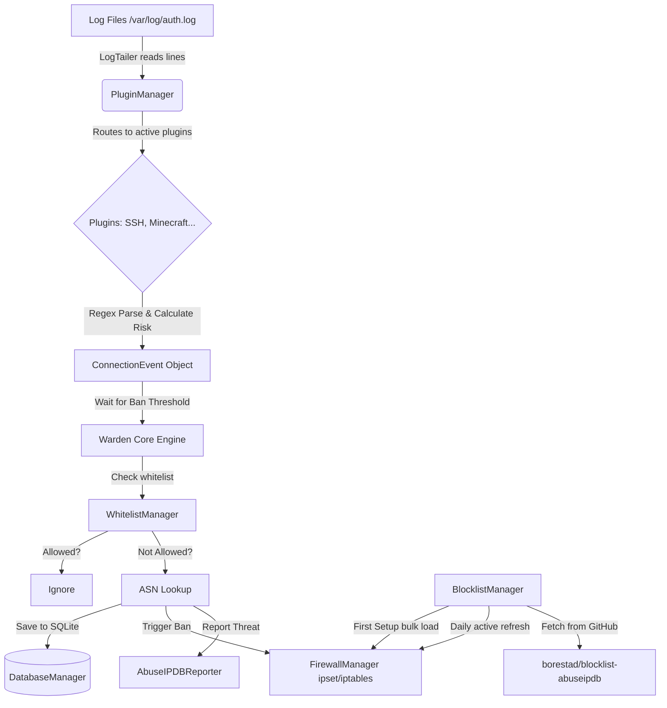

# WardenIPS - Architecture & Developer Guide (v0.2.7-beta-3)

This document is the official technical map of the **WardenIPS** ecosystem. It is designed for developers who want to:
1. **Understand** how the system works under the hood.
2. **Build** external applications (like a Web Dashboard, REST API, or Discord Bot).
3. **Extend** WardenIPS by writing new plugins or core features.

---

## 🏗️ 1. High-Level Architecture (The Flow)

WardenIPS is entirely **asynchronous** (`asyncio`), meaning it never blocks while reading logs, querying databases, or executing firewall bans.



---

## 🔌 2. Core Components Mapping

If you want to edit the core, here is where everything lives inside `wardenips/core/`:

| Component | File | Purpose | Developer Tips & Suggestions |
|-----------|------|---------|------------------------------|
| **Brain** | `main.py` | Orchestrates all managers and loops. | *If you want to add a REST API using FastAPI for a web dashboard, you should attach the FastAPI app to the `asyncio` loop running in `main.py`.* |
| **Config** | `config.py` | Singleton. Reads `config.yaml`. | *Use `config.get("section.key")`. It supports hot-reloading (mostly).* |
| **DB** | `database.py` | Asynchronous SQLite operations. | *This is crucial for Web Dashboards. The `get_active_bans()` function is what your dashboard will query to show charts!* |
| **Firewall** | `firewall.py` | Manages `ipset`. Simulation mode on Windows. | *If you add Docker support, you will need to modify this file to interact with Docker's internal networking instead of just host `iptables`.* |
| **Tailer** | `log_tailer.py`| Cross-platform asynchronous file reader. | *Uses polling instead of `inotify`. Safe for all OS. If logs rotate, it catches them gracefully.* |
| **Blocklist** | `blocklist.py` | AbuseIPDB curated IP blocklist manager. | *Manages two ipset sets: `wardenips_first_setup` (temporary bulk load) and `wardenips_active` (daily refresh). Uses `ipset restore` for high-performance bulk loading. Fetches from GitHub raw URLs.* |

---

## 🌐 3. How to Build a Web Dashboard for WardenIPS

WardenIPS currently uses SQLite. If you want to build a frontend (React, Vue, Next.js), you need to build a **Reader API** (e.g., in Python FastAPI or Node.js).

### Suggested Dashboard Architecture:
1. **Backend API (FastAPI/Express):** Connects to `/var/lib/wardenips/warden.db` in **Read-Only** mode.
2. **Frontend (React/Next.js):** Fetches data from the API and displays it beautifully.

### Important Database Tables you will query:

- `connection_events`: Contains every parsed login attempt.
  - Useful for: *Line charts showing "Attacks over time"*, *Pie charts for "Top targeted services (SSH vs Nginx)"*.
- `ban_history`: Contains actual bans executed by FirewallManager.
  - Useful for: *The main "Currently Blocked IPs" data table.*
- `whitelist`: IPs that are immune.
  - Useful for: *A settings page on the dashboard to allow admins to add/remove IPs.*

> **💡 Suggestion:** If you build a dashboard, you should also read the `warden.log` file using WebSockets to provide a "Live Terminal" view on the website!

---

## 🧩 4. How to Create a New Plugin (Extending WardenIPS)

If you want WardenIPS to protect a new service (e.g., Nginx, Apache, FTP), you just need to create a **Plugin**.

1. Create a new file: `wardenips/plugins/nginx_plugin.py`
2. Inherit from `BasePlugin`
3. Implement `parse_line()` and `calculate_risk()`.

### Example Template:

```python
import re
from typing import Optional
from wardenips.core.models import ConnectionEvent, ConnectionType, ThreatLevel
from wardenips.plugins.base_plugin import BasePlugin

class NginxPlugin(BasePlugin):
    # This regex is an example to catch Nginx 404/403 errors (web scraping / directory traversal)
    _NGINX_PATTERN = re.compile(r'^(?P<ip>\d+\.\d+\.\d+\.\d+) - - \[.*?\] "GET /(?P<path>.*?) HTTP/.*?" (?P<status>403|404)')

    @property
    def name(self) -> str:
        return "Nginx"

    @property
    def log_file_path(self) -> str:
        return self._config.get("plugins.nginx.log_path", "/var/log/nginx/access.log")

    async def parse_line(self, line: str) -> Optional[ConnectionEvent]:
        match = self._NGINX_PATTERN.search(line)
        if not match:
            return None # Not a threat or not our line type
        
        return ConnectionEvent(
            timestamp=datetime.now(datetime.UTC),
            source_ip=match.group("ip"),
            connection_type=ConnectionType.NGINX,
            threat_level=ThreatLevel.LOW, # Starts low, increases if they do it 100 times.
            details={"path": match.group("path"), "status": match.group("status")}
        )

    async def calculate_risk(self, event: ConnectionEvent, context: dict) -> int:
        # Example Engine: If they get 404 more than 20 times in 1 minute, BAN!
        recent_count = context.get("event_count", 1)
        if recent_count > 20:
            return 80 # Ban margin
        return 20
```

> **💡 Don't forget:** After creating the plugin, you must import it in `main.py` and register it with `plugin_manager.register(NginxPlugin(self._config))`!

---

## 🔄 5. Future Implementation Suggestions

If you are a contributor looking to improve this project, here are the most impactful areas:

1. **Blocklist Enhancements:**
   - The current blocklist system fetches from [`borestad/blocklist-abuseipdb`](https://github.com/borestad/blocklist-abuseipdb). Additional curated sources could be integrated as optional feeds.
   - Consider adding configurable confidence thresholds or category-based filtering.
   - IPv6 blocklists could be supported when upstream sources provide them.
2. **Redis Integration:**
   - Update `database.py`. SQLite is fine for single servers, but for a 50-server cluster, a centralized Redis instance is needed to track "failed attempts" across the entire network simultaneously.
3. **Docker Support:**
   - Docker bypasses standard `iptables` INPUT chain because it uses PREROUTING and the DOCKER-USER chain.
   - You will need to update `firewall.py` to insert the `ipset` match rule into the `DOCKER-USER` chain on Linux if Docker is detected!
