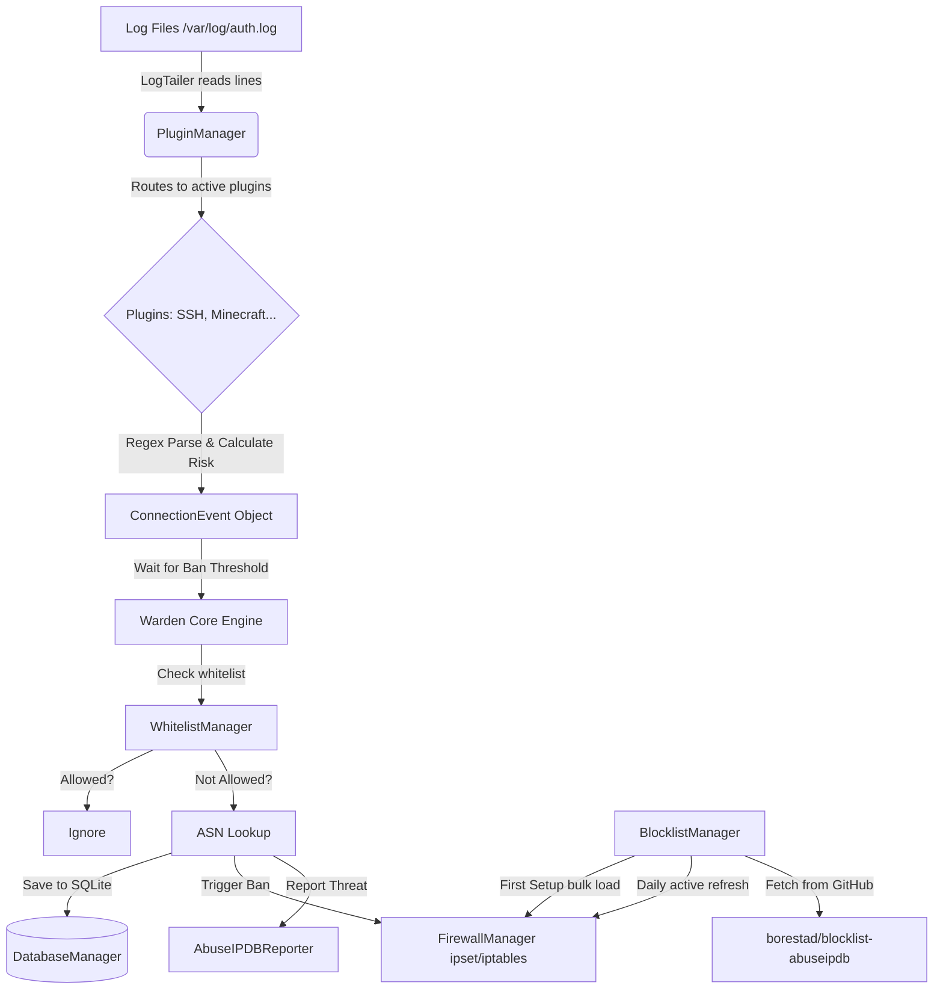

# WardenIPS - Architecture & Developer Guide (v1.0.0)

This document is the official technical map of the **WardenIPS** ecosystem. It is designed for developers who want to:
1. **Understand** how the system works under the hood.
2. **Build** external applications (like a Web Dashboard, REST API, or Discord Bot).
3. **Extend** WardenIPS by writing new plugins or core features.

---

## 🏗️ 1. High-Level Architecture (The Flow)

WardenIPS is entirely **asynchronous** (`asyncio`), meaning it never blocks while reading logs, querying databases, or executing firewall bans.


```mermaid
graph TD
    A[Log Files /var/log/auth.log] -->|LogTailer reads lines| B(PluginManager)
    B -->|Routes to active plugins| C{Plugins: SSH, Minecraft...}
    C -->|Regex Parse & Calculate Risk| D[ConnectionEvent Object]
    D -->|Wait for Ban Threshold| E[Warden Core Engine]
    
    E -->|Check whitelist| F[WhitelistManager]
    F -->|Allowed?| G[Ignore]
    F -->|Not Allowed?| H[ASN Lookup]
    
    H -->|Save to SQLite| I[(DatabaseManager)]
    H -->|Trigger Ban| J[FirewallManager ipset/iptables]
    H -->|Report Threat| K[AbuseIPDBReporter]
    
    L[BlocklistManager] -->|First Setup bulk load| J
    L -->|Daily active refresh| J
    L -->|Fetch from GitHub| M[borestad/blocklist-abuseipdb]
```

---

## 🔌 2. Core Components Mapping

If you want to edit the core, here is where everything lives inside `wardenips/core/`:

| Component | File | Purpose | Developer Tips & Suggestions |
|-----------|------|---------|------------------------------|
| **Brain** | `main.py` | Orchestrates all managers and loops. | *If you want to add a REST API using FastAPI for a web dashboard, you should attach the FastAPI app to the `asyncio` loop running in `main.py`.* |
| **Config** | `config.py` | Singleton. Reads `config.yaml`. | *Use `config.get("section.key")`. It supports hot-reloading (mostly).* |
| **DB** | `database.py` | Asynchronous SQLite operations. | *This is crucial for Web Dashboards. The `get_active_bans()` function is what your dashboard will query to show charts!* |
| **Firewall** | `firewall.py` | Manages `ipset`. Simulation mode on Windows. | *If you add Docker support, you will need to modify this file to interact with Docker's internal networking instead of just host `iptables`.* |
| **Tailer** | `log_tailer.py`| Cross-platform asynchronous file reader. | *Uses polling instead of `inotify`. Safe for all OS. If logs rotate, it catches them gracefully.* |
| **Blocklist** | `blocklist.py` | AbuseIPDB curated IP blocklist manager. | *Manages two ipset sets: `wardenips_first_setup` (temporary bulk load) and `wardenips_active` (daily refresh). Uses `ipset restore` for high-performance bulk loading. Fetches from GitHub raw URLs.* |

---

## 🌐 3. How to Build a Web Dashboard for WardenIPS

WardenIPS currently uses SQLite. If you want to build a frontend (React, Vue, Next.js), you need to build a **Reader API** (e.g., in Python FastAPI or Node.js).

### Suggested Dashboard Architecture:
1. **Backend API (FastAPI/Express):** Connects to `/var/lib/wardenips/warden.db` in **Read-Only** mode.
2. **Frontend (React/Next.js):** Fetches data from the API and displays it beautifully.

### Important Database Tables you will query:

- `connection_events`: Contains every parsed login attempt.
  - Useful for: *Line charts showing "Attacks over time"*, *Pie charts for "Top targeted services (SSH vs Nginx)"*.
- `ban_history`: Contains actual bans executed by FirewallManager.
  - Useful for: *The main "Currently Blocked IPs" data table.*
- `whitelist`: IPs that are immune.
  - Useful for: *A settings page on the dashboard to allow admins to add/remove IPs.*

> **💡 Suggestion:** If you build a dashboard, you should also read the `warden.log` file using WebSockets to provide a "Live Terminal" view on the website!

---

## 🧩 4. How to Create a New Plugin (Extending WardenIPS)

If you want WardenIPS to protect a new service (e.g., Nginx, Apache, FTP), you just need to create a **Plugin**.

1. Create a new file: `wardenips/plugins/nginx_plugin.py`
2. Inherit from `BasePlugin`
3. Implement `parse_line()` and `calculate_risk()`.

### Example Template:

```python
import re
from typing import Optional
from wardenips.core.models import ConnectionEvent, ConnectionType, ThreatLevel
from wardenips.plugins.base_plugin import BasePlugin

class NginxPlugin(BasePlugin):
    # This regex is an example to catch Nginx 404/403 errors (web scraping / directory traversal)
    _NGINX_PATTERN = re.compile(r'^(?P<ip>\d+\.\d+\.\d+\.\d+) - - \[.*?\] "GET /(?P<path>.*?) HTTP/.*?" (?P<status>403|404)')

    @property
    def name(self) -> str:
        return "Nginx"

    @property
    def log_file_path(self) -> str:
        return self._config.get("plugins.nginx.log_path", "/var/log/nginx/access.log")

    async def parse_line(self, line: str) -> Optional[ConnectionEvent]:
        match = self._NGINX_PATTERN.search(line)
        if not match:
            return None # Not a threat or not our line type
        
        return ConnectionEvent(
            timestamp=datetime.now(datetime.UTC),
            source_ip=match.group("ip"),
            connection_type=ConnectionType.NGINX,
            threat_level=ThreatLevel.LOW, # Starts low, increases if they do it 100 times.
            details={"path": match.group("path"), "status": match.group("status")}
        )

    async def calculate_risk(self, event: ConnectionEvent, context: dict) -> int:
        # Example Engine: If they get 404 more than 20 times in 1 minute, BAN!
        recent_count = context.get("event_count", 1)
        if recent_count > 20:
            return 80 # Ban margin
        return 20
```

> **💡 Don't forget:** After creating the plugin, you must import it in `main.py` and register it with `plugin_manager.register(NginxPlugin(self._config))`!

---

## 🔄 5. Future Implementation Suggestions

If you are a contributor looking to improve this project, here are the most impactful areas:

1. **Blocklist Enhancements:**
   - The current blocklist system fetches from [`borestad/blocklist-abuseipdb`](https://github.com/borestad/blocklist-abuseipdb). Additional curated sources could be integrated as optional feeds.
   - Consider adding configurable confidence thresholds or category-based filtering.
   - IPv6 blocklists could be supported when upstream sources provide them.
2. **Redis Integration:**
   - Update `database.py`. SQLite is fine for single servers, but for a 50-server cluster, a centralized Redis instance is needed to track "failed attempts" across the entire network simultaneously.
3. **Docker Support:**
   - Docker bypasses standard `iptables` INPUT chain because it uses PREROUTING and the DOCKER-USER chain.
   - You will need to update `firewall.py` to insert the `ipset` match rule into the `DOCKER-USER` chain on Linux if Docker is detected!

---

## 🛠️ 6. Professional CLI & REST API Architecture (v1.0.0+)

#### Overview: Dual-Mode Client Design

WardenIPS now supports **two operational modes** for programmatic access:

1. **Direct Mode** (`wardenips-cli` with `--direct`): Direct database + firewall access (requires `root`)
2. **API Mode** (`wardenips-cli --use-api`): HTTP API with authentication and auditing

This dual-mode design allows:
- **Local Operations**: Fast, synchronous access to database/firewall (ideal for cron jobs, local dashboards)
- **Remote Operations**: Audited HTTP API with session management (ideal for multi-team, multi-tenant, or distributed setups)

### CLI Architecture (`wardenips/cli/`)

**Entry Point:** `wardenips-cli` command (installed via `setup.py`)

```rust
wardenips/cli/
├── main.py                  # CLI entry point, argparse CLI builder, command routing
├── commands/                # Command implementations (future: organized by domain)
│   └── __init__.py
├── client/                  # Abstraction layer for database/firewall/config access
│   ├── __init__.py          # get_client() factory (selects Direct or API mode)
│   ├── base.py              # BaseClient abstract interface (18 async methods)
│   ├── direct.py            # DirectClient: local DB + firewall access (root required)
│   ├── api.py               # APIClient: HTTP client with Bearer token auth
│   └── exceptions.py        # Client error hierarchy
```

**Key Features:**
- **Automatic Mode Selection**: `get_client()` analyzes config + args to select Direct or API mode
- **8 Command Groups**: `ban`, `whitelist`, `firewall`, `config`, `plugins`, `database`, `auth`, `status`
- **Output Formats**: Text (default), JSON, CSV
- **Global Options**: `--config`, `--use-api`, `--api-url`, `--api-key`, `--output`, `--verbose`

**Example CLI Flows:**
```bash
# Ban an IP (Direct mode - reads from local DB, applies firewall immediately)
wardenips-cli ban add 192.168.1.100 --reason "Brute-force" --duration 3600

# Ban IPs through API (Audited, requires API key)
wardenips-cli ban add 192.168.1.100 --use-api --api-url https://wardenips.mynet.local --api-key xxx

# Config hot-reload without service restart
wardenips-cli config reload --components whitelist,firewall

# List active bans
wardenips-cli ban list --output json
```

### REST API Architecture (`wardenips/api/`)

**Base Path:** `/api/` (e.g., `http://localhost:8080/api/`)

**Migration Namespace:** `/api/v2/`
- During Phase 3, modular route handlers are also exposed under `/api/v2/*`.
- Legacy monolithic handlers remain under `/api/*` until migration completes.
- This allows side-by-side validation without breaking existing clients.

The API is organized into multiple **modular routes** with clear separation of concerns:

```rust
wardenips/api/
├── routes/
│   ├── __init__.py                  # setup_all_routes() orchestration
│   ├── public.py                    # 10 read-only public endpoints
│   ├── auth.py                      # Login, logout, session management
│   ├── admin_users.py               # User, invite, role management
│   ├── whitelist.py                 # Whitelist CRUD operations
│   ├── banning.py                   # Ban/unban operations
│   ├── config.py                    # Config management with hot-reload
│   └── operational.py               # Firewall, plugins, database ops
│
├── services/                        # Business logic (reusable by CLI + API)
│   ├── __init__.py
│   ├── ban_service.py               # Ban logic: validation, firewall apply, DB record
│   ├── auth_service.py              # TOTP, password hashing, session management
│   ├── whitelist_service.py         # Whitelist CRUD + is_whitelisted() checks
│   ├── config_service.py            # Config CRUD + validation + hot-reload
│   ├── firewall_service.py          # Firewall reconciliation, rule management
│   ├── permission_service.py        # RBAC (Role-Based Access Control)
│   └── audit_service.py             # Audit logging for all operations
│
└── dashboard.py                     # DashboardAPI (being refactored: 4800 → 600 LOC)
```

### Routes Reference (Phase 2B-C Complete)

#### Public Routes (Read-Only, Authenticated Optional)
```
GET /api/health              -- Server health + uptime
GET /api/stats               -- Database statistics
GET /api/events              -- Recent events (paginated)
GET /api/bans                -- Active bans list
GET /api/firewall            -- Firewall operational status
GET /api/top-attackers       -- Top source IPs by event count
GET /api/events-timeline     -- Events grouped by hour
GET /api/asn-stats           -- Events grouped by ASN
GET /api/threat-distribution -- Events by threat level
GET /api/plugin-stats        -- Events by plugin type
```

#### Authentication Routes
```
POST /api/login              -- Authenticate with username/password/TOTP
POST /api/logout             -- Invalidate session
POST /api/session-activity   -- Keep-alive / activity update
```

#### User Management Routes (Admin Only)
```
GET    /api/admin/users                    -- List users
POST   /api/admin/users                    -- Create user
GET    /api/admin/users/{user_id}          -- Get user details
PATCH  /api/admin/users/{user_id}          -- Update user
DELETE /api/admin/users/{user_id}          -- Delete user
GET    /api/admin/invites                  -- List pending invites
POST   /api/admin/invites                  -- Create invite
POST   /api/admin/invites/{invite_id}/accept -- Accept invite
PATCH  /api/admin/users/{user_id}/roles    -- Assign roles
GET    /api/admin/audit-log                -- Get audit log entries
```

#### Whitelist Routes
```
GET    /api/admin/whitelist                -- List whitelist entries
POST   /api/admin/whitelist/add            -- Add entry
DELETE /api/admin/whitelist/{entry_id}     -- Remove entry
PATCH  /api/admin/whitelist/{entry_id}     -- Update entry
```

#### Banning Routes
```
POST   /api/admin/ban-ip                   -- Ban an IP
DELETE /api/admin/ban/{ip}                 -- Unban an IP
GET    /api/admin/bans                     -- List active bans
POST   /api/admin/bulk-ban                 -- Ban multiple IPs
POST   /api/admin/firewall/reconcile       -- Sync DB with firewall
```

#### Configuration Routes
```
GET    /api/admin/config                   -- Get current config
PATCH  /api/admin/config                   -- Update config
POST   /api/admin/config/reload            -- Hot-reload config (NEW)
POST   /api/admin/config/validate          -- Validate config
```

#### Operational Routes
```
GET    /api/admin/firewall/status          -- Live firewall state
POST   /api/admin/firewall/sync            -- Reconcile firewall rules
GET    /api/admin/plugins                  -- List plugins + status
GET    /api/admin/plugins/{name}           -- Get plugin details
POST   /api/admin/plugins/{name}/reload    -- Reload plugin config
GET    /api/admin/database/stats           -- Extended DB statistics
POST   /api/admin/database/optimize        -- Run VACUUM + ANALYZE
```

### Service Layer (Business Logic)

Each service encapsulates domain-specific logic, making it reusable across CLI, API, and future integrations:

- **BanService**: Ban/unban operations with validation, firewall application, DB recording
- **AuthService**: Authentication (password hashing, TOTP), session management
- **WhitelistService**: Whitelist CRUD + is_whitelisted() checks
- **ConfigService**: Config CRUD + validation + hot-reload coordination
- **FirewallService**: Firewall rule management and reconciliation
- **PermissionService**: RBAC checks (admin, operator, viewer, analyst roles)
- **AuditService**: Audit logging for all sensitive admin operations

### Integration with Core

The refactored CLI and API integrate seamlessly with existing core components:

```python
from wardenips.core.config import ConfigManager
from wardenips.core.database import DatabaseManager
from wardenips.core.firewall import FirewallManager
from wardenips.core.hot_reload import HotReloadManager

# Services receive existing managers
dependencies = {
    "db": DatabaseManager(...),
    "firewall": FirewallManager(...),
    "config": ConfigManager(...),
    "hot_reload": HotReloadManager(...),
    
    # Instantiated services
    "ban_service": BanService(db, firewall, whitelist),
    "auth_service": AuthService(db),
    "config_service": ConfigService(ConfigManager, HotReloadManager),
    # ... more services
}

# Routes and CLI both use same services
setup_all_routes(app, dependencies)
```

### Hot-Reload (Zero-Downtime Configuration Updates)

The `HotReloadManager` (in `wardenips/core/hot_reload.py`) enables live config reloads:

```bash
# Signal-based (on Linux)
kill -HUP $(pidof python3)  # or systemctl reload wardenips

# API-based (work in progress)
curl -X POST http://localhost:8080/api/admin/config/reload \
  -H "Authorization: Bearer <token>" \
  -H "Content-Type: application/json" \
  -d '{"components": ["whitelist", "firewall"]}'
```

Reloadable components:
- `config`: Re-read config.yaml
- `whitelist`: Reload whitelist from DB + config
- `firewall`: Reconcile kernel rules with DB state
- `plugins`: Reload plugin configurations
- `notifications`: Reload notification backend

This zero-downtime reload is critical for production use, allowing config updates without restarting the service.
