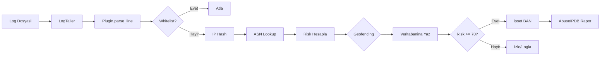

# WardenIPS - Proje Tamamlandi

## Final Dosya Yapisi

```
WardenIPS/
├── wardenips/
│   ├── __init__.py
│   ├── core/
│   │   ├── __init__.py
│   │   ├── config.py           # Async Singleton ConfigManager
│   │   ├── whitelist.py        # IP/CIDR + Geofencing
│   │   ├── logger.py           # UTF-8 loglama
│   │   ├── exceptions.py       # Ozel exception'lar
│   │   ├── models.py           # ConnectionEvent + ThreatLevel
│   │   ├── asn_lookup.py       # MaxMind GeoLite2 lokal ASN
│   │   ├── ip_hasher.py        # KVKK HMAC+SHA-256
│   │   ├── database.py         # Async SQLite + WAL
│   │   ├── firewall.py         # ipset banlama
│   │   ├── abuseipdb.py        # AbuseIPDB raporlayici
│   │   └── log_tailer.py       # Async log tailing
│   └── plugins/
│       ├── __init__.py
│       ├── base_plugin.py      # BasePlugin + PluginManager
│       ├── ssh_plugin.py       # auth.log brute-force tespiti
│       └── minecraft_plugin.py # latest.log botnet tespiti
├── config.yaml                 # Ana yapilandirma
├── requirements.txt            # Python bagimliklar
├── main.py                     # Production giris noktasi
├── INSTALL.md                  # Kurulum rehberi
└── WARDEN_ARCHITECTURE.md      # Mimari dokumani
```

**Toplam: 15 kaynak dosya + 2 dokuman**

---

## Olay Isleme Pipeline'i



---

## Dogrulama

| Test | Sonuc |
|------|-------|
| 11 modul import | ✅ |
| main.py syntax | ✅ |
| `--version` | WardenIPS v0.1.0 ✅ |

---

## Kurulum

Detayli kurulum icin: [INSTALL.md](file:///c:/Users/KayganYol/GithubProjects/WardenIPS/INSTALL.md)

**Hizli baslatma:**

```bash
# 1. Bagimliklar
pip3 install -r requirements.txt

# 2. config.yaml'da salt degerini ve whitelist IP'lerini guncelleyin

# 3. Calistir
sudo python3 main.py
```
